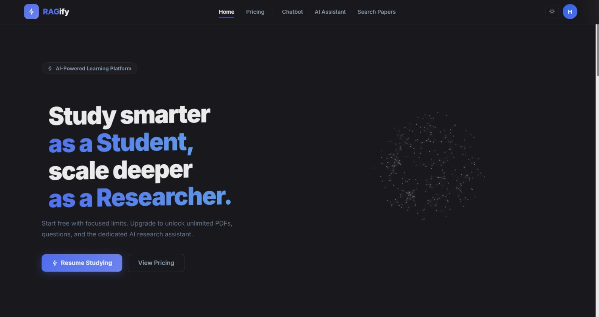
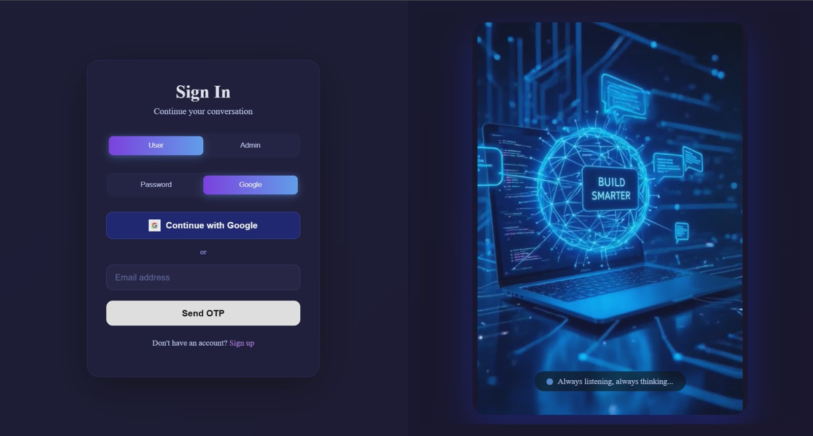
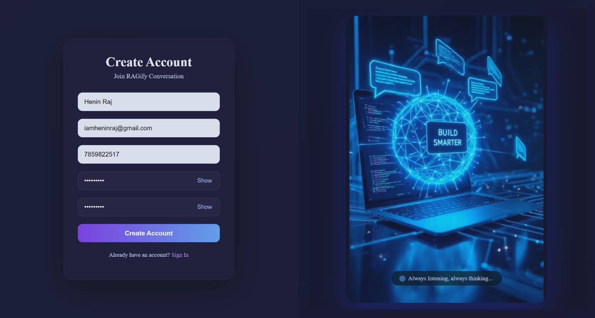
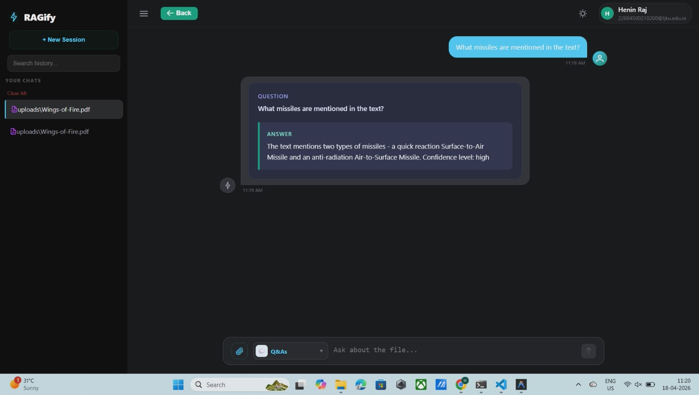
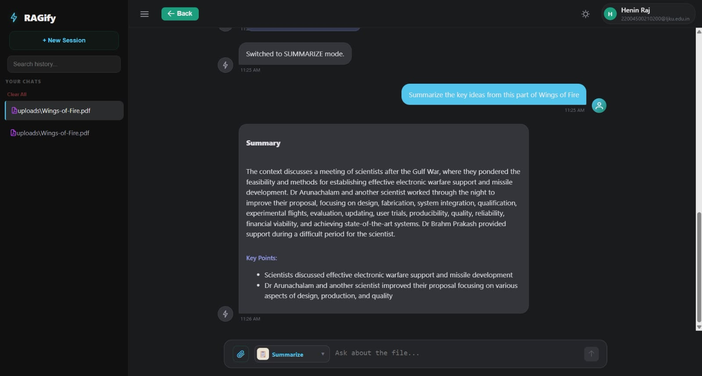
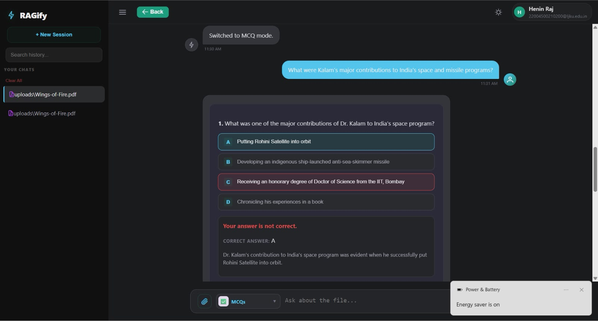
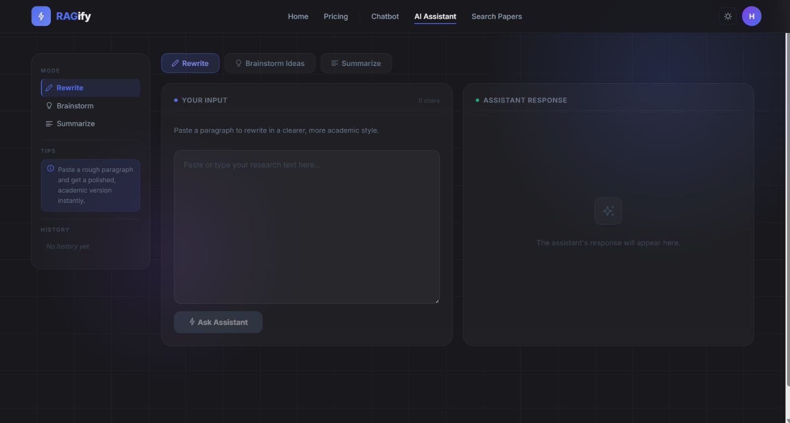
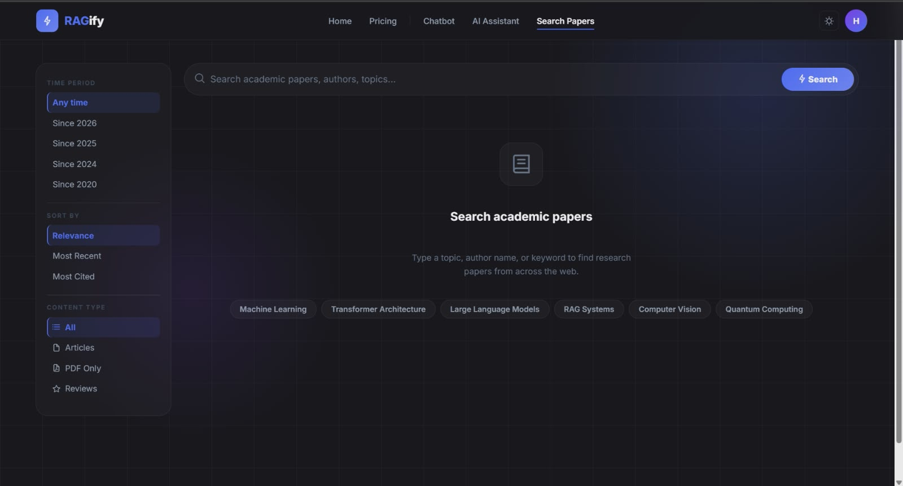
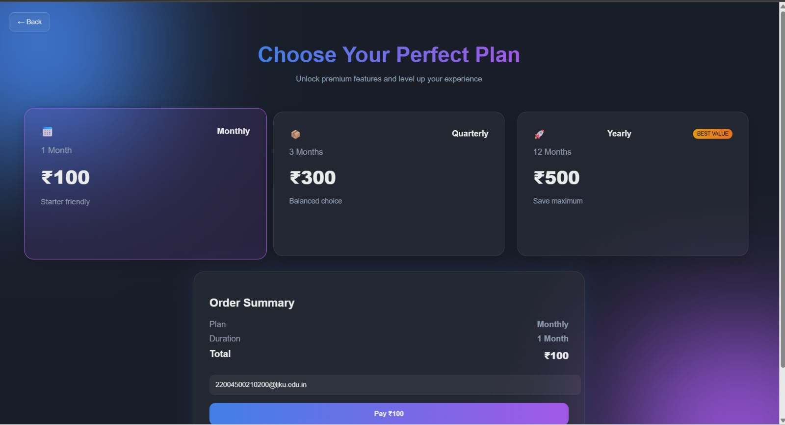

# 🧠 RAGify – AI Research & Study Assistant

RAGify is a **full-stack AI-powered research and learning platform** that allows users to upload PDFs, interact with them using a **Retrieval-Augmented Generation (RAG)** system, and leverage advanced AI tools for studying and research.

It combines **LLMs, vector search, and full-stack engineering** to deliver an intelligent document understanding experience.

---

## 🚀 Key Features

### 📄 Document Intelligence (RAG Chatbot)

* Upload PDFs and interact with them using natural language
* Context-aware **question answering**
* Generate:

  * 📝 Summaries
  * 🧠 Flashcards
  * ❓ MCQs

---

### 🧪 AI Research Assistant *(Paid Feature)*

* ✍️ Rewrite content in academic style
* 💡 Brainstorm ideas
* 📚 Summarize paragraphs
* Designed for researchers and advanced users

---

### 🔍 Research Paper Search

* Fetch **top 10 research papers** based on user queries
* Helps users explore relevant academic content quickly

---

### 🔐 Authentication & User Roles

* Phone/password login (users), email login (admins)
* Google OAuth integration
* Role-based access:

  * **Student (Free)** → Limited usage
  * **Researcher (Paid)** → Full access
  * **Admin** → Dashboard access

---

### 💳 Subscription & Payments

* Integrated **Stripe Checkout**
* Upgrade from Student → Researcher
* Automatic role update with JWT refresh

---
## 📸 Screenshots

> 🚀 A glimpse of the AI-powered research and learning experience provided by RAGify.

---

### 🏠 Home Interface  
Clean and intuitive dashboard for navigating features and accessing tools.  



---

### 🔐 User Authentication  
Secure login and signup system with role-based access.  

  


---

### 💬 PDF Chat (RAG Q&A)  
Interact with uploaded documents using context-aware question answering.  



---

### 📝 AI Summary Generation  
Automatically generate concise summaries from PDF content.  



---

### 🧠 Flashcard Generation  
Convert study material into interactive flashcards for better learning.  


---

### ❓ MCQ Generation  
Generate multiple-choice questions for practice and assessment.  



---

### ✍️ AI Research Assistant (Rewrite & Brainstorm)  
Enhance research workflow with rewriting, idea generation, and content refinement.  



---

### 🔍 Research Paper Search  
Discover top relevant research papers based on user queries.  



---

### 💳 Subscription Plans  
Flexible pricing plans with upgrade options for advanced features.  




## 🧠 System Architecture

RAGify is built using a **multi-service architecture**:

* **Frontend**: Angular (modern standalone components)
* **Backend (Auth & Payments)**: Node.js + Express
* **AI Backend (RAG Engine)**: Flask (Python)
* **Vector DB**: Pinecone
* **Database**: MongoDB
* **Embeddings**: Fine-tuned Sentence-BERT model

---

## ⚙️ Tech Stack

* **Frontend**: Angular 19+, Vite
* **Backend**: Node.js, Express, Mongoose
* **AI/ML**: Flask, Hugging Face API, Sentence Transformers
* **Database**: MongoDB
* **Vector Search**: Pinecone
* **Auth**: JWT, Passport.js, Google OAuth
* **Payments**: Stripe

---

## 🧩 Core Architecture

```
Frontend (Angular)
        ↓
Node.js Backend (Auth, Payments, Roles)
        ↓
Flask RAG Backend (LLM + Retrieval)
        ↓
Pinecone (Vector DB) + MongoDB
```

---

## 🎯 User Plans

### 🎓 Student (Free)

* 1 PDF upload/day
* 5 queries/day
* Access to chatbot (Q&A, summaries, flashcards, MCQs)
* Research assistant locked

---

### 🔬 Researcher (Paid)

* Unlimited uploads & queries
* Full AI research assistant access
* Advanced content tools

---

### 🛠️ Admin

* Separate dashboard
* Full system control

---

## 🔄 Upgrade Flow

1. User selects plan → Stripe Checkout
2. On success → redirected to `/payment-success`
3. Backend upgrades role → returns new JWT
4. User gains researcher access instantly

---

## 📂 Project Structure

```
/src & /public        → Angular frontend
/backend              → Node.js API (auth, payments)
/rag-backend          → Flask RAG system
/Quora_stsb_finetune → Custom embedding model
```

---

## ⚡ Getting Started

### 1. Clone & Install

```bash
npm install
```

---

### 2. Run Frontend

```bash
npm run start
```

→ [http://localhost:4200](http://localhost:4200)

---

### 3. Run Backend (Node.js)

```bash
cd backend
npm install
npm run start
```

→ [http://localhost:5000](http://localhost:5000)

---

### 4. Run RAG Backend (Python)

```bash
cd rag-backend
pip install -r requirements.txt
python app.py
```

→ [http://localhost:5001](http://localhost:5001)

---

## 🔐 Environment Variables

### Node Backend

```env
MONGO_URI=
JWT_SECRET=
GOOGLE_CLIENT_ID=
STRIPE_SECRET_KEY=
```

---

### RAG Backend

```env
PINECONE_API_KEY=
HF_API_KEY=
HF_ASSISTANT_MODEL=
```

---

## 🧠 Key Highlights

* Combines **LLMs + RAG + Full-stack engineering**
* Implements **role-based SaaS architecture**
* Uses **real-world production tools (Stripe, Pinecone, OAuth)**
* Includes **custom embedding model**

---

## 🚀 Future Improvements

* Real-time document collaboration
* Multi-document querying
* Voice-based interaction
* Advanced citation generation

---

## 👨‍💻 Author

Developed by **Vignesh**

* AI/ML Engineer | Full Stack Developer

